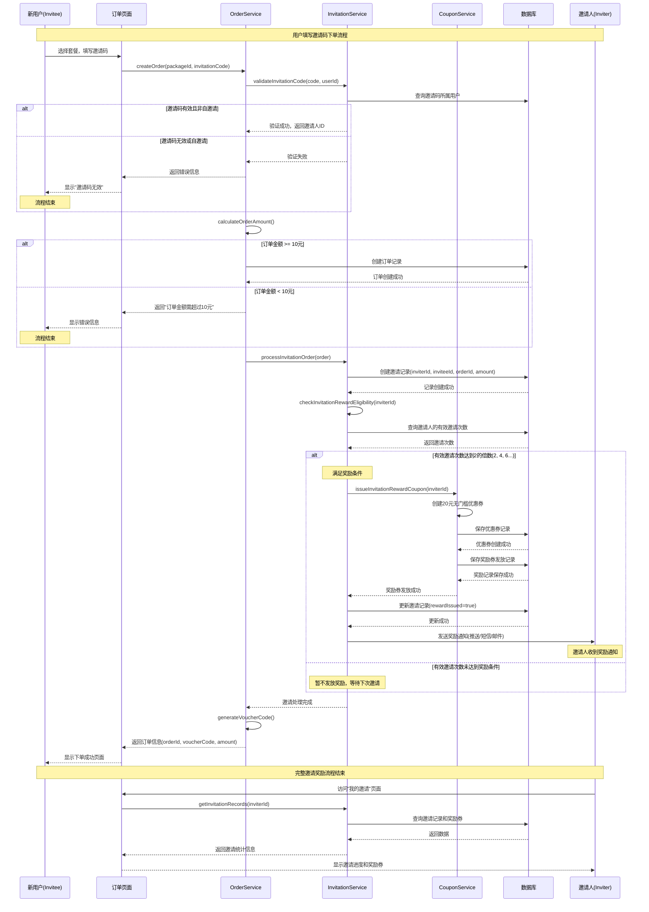

# Lab4 问答题答案

## Q1. 需求完整性与职责边界分析

### 问题背景
在需求部分的"邀请下单规则"中，有这样一个条件：
> 应避免用户使用自己的邀请码。

如果这个限制没有被提前定义，而最终出现了"用户使用自己邀请码领取奖励"的问题，你认为这属于：
- 产品经理的职责缺失？
- 开发人员没有考虑边界情况？
- 还是测试环节未能发现逻辑漏洞？

### 答案分析

**我认为这是一个典型的跨职能协作问题，责任应该由多个角色共同承担，但根本原因是需求评审环节的不充分。**

#### 1. 产品经理的职责分析
**主要责任（60%）**
- **需求完整性缺失**：产品经理在设计邀请机制时，应该从业务逻辑角度考虑所有可能的边界情况和异常场景
- **业务规则定义不明确**：邀请系统的核心目标是"拉新获客"，如果允许自邀请，完全违背了业务目标
- **需求文档不完善**：应该在PRD中明确列出"不允许自邀请"这类关键业务规则

#### 2. 开发人员的职责分析
**次要责任（25%）**
- **边界情况考虑不足**：经验丰富的开发人员应该主动识别这类明显的业务逻辑漏洞
- **需求理解不深入**：开发过程中应该对业务逻辑进行合理性判断
- **代码防御性不够**：在实现邀请验证时缺乏必要的边界检查

#### 3. 测试人员的职责分析
**次要责任（15%）**
- **测试用例设计不全面**：应该包含各种边界情况和异常场景的测试
- **业务逻辑验证不充分**：测试不仅要验证功能实现，还要验证业务合理性

#### 4. 根本原因与解决方案

**根本原因**：
- **需求评审环节不充分**：缺乏跨团队的深度讨论和场景分析
- **业务理解不统一**：团队成员对邀请机制的业务目标理解不一致
- **风险识别机制缺失**：没有建立系统性的边界情况识别流程

**最佳实践建议**：
1. **需求评审阶段**：产品、开发、测试三方共同进行"边界情况脑暴"
2. **开发阶段**：建立"业务逻辑合理性检查"的代码审查标准
3. **测试阶段**：建立"异常场景测试清单"，包含自操作、循环引用等边界情况
4. **上线前**：进行"业务逻辑走查"，确保功能实现符合业务预期

### 结论
这个问题反映了需求工程中"需求完整性"的重要性。在现代敏捷开发中，**每个角色都应该具备业务思维**，主动识别和预防此类逻辑漏洞。最有效的解决方案是建立**跨职能的需求评审机制**，确保业务规则的完整性和一致性。

---

## Q3. 系统模块关系UML类图

### 设计说明
根据Lab4需求，设计包含点评功能、邀请机制、优惠券发放、订单结算四个模块的类图，体现模块间的依赖关系和业务逻辑。

```mermaid
classDiagram
    %% 用户和商家基础类
    class User {
        +int id
        +String username
        +String email
        +String phone
        +String invitationCode
        +Date createdAt
        +generateInvitationCode()
        +getReviewCount()
    }

    class Shop {
        +int id
        +String name
        +String address
        +String phone
        +float rating
        +String description
        +List~Package~ packages
        +List~Review~ reviews
    }

    class Package {
        +int id
        +int shopId
        +String title
        +float price
        +String description
        +String contents
        +int sales
    }

    %% 订单结算模块
    class Order {
        +int id
        +int userId
        +int packageId
        +float originalAmount
        +float finalAmount
        +String voucherCode
        +String invitationCode
        +Date createdAt
        +OrderStatus status
        +calculateDiscount()
        +applyInvitationCode()
        +applyCoupon()
    }

    class OrderService {
        +createOrder(OrderRequest)
        +validateInvitationCode(String)
        +calculateOrderAmount(Order)
        +processInvitationReward(Order)
        +generateVoucherCode()
    }

    %% 优惠券发放模块
    class Coupon {
        +int id
        +String name
        +CouponType type
        +float discountValue
        +float maxDiscount
        +Date expiryDate
        +CouponStatus status
        +isValid()
        +calculateDiscount(float)
    }

    class CouponService {
        +List~Coupon~ getAvailableCoupons(int userId)
        +Coupon issueReviewRewardCoupon(int userId)
        +Coupon issueInvitationRewardCoupon(int userId)
        +boolean validateCoupon(int couponId)
        +applyCouponDiscount(Order, Coupon)
    }

    class RewardCoupon {
        +int id
        +int userId
        +int couponId
        +RewardType rewardType
        +Date issuedAt
        +String reason
    }

    %% 邀请机制模块
    class InvitationService {
        +String getUserInvitationCode(int userId)
        +List~InvitationRecord~ getInvitationRecords(int userId)
        +boolean validateInvitationCode(String code, int userId)
        +processInvitationOrder(Order)
        +checkInvitationRewardEligibility(int userId)
        +issueInvitationReward(int userId)
    }

    class InvitationRecord {
        +int id
        +int inviterId
        +int inviteeId
        +int orderId
        +float orderAmount
        +Date orderTime
        +boolean rewardIssued
    }

    %% 点评功能模块
    class Review {
        +int id
        +int userId
        +int shopId
        +String content
        +Date createdAt
        +List~Reply~ replies
        +int getCharacterCount()
        +boolean isValidReview()
    }

    class Reply {
        +int id
        +int reviewId
        +int userId
        +String content
        +Date createdAt
        +int parentId
    }

    class ReviewService {
        +List~Review~ getShopReviews(int shopId, Pagination)
        +Review createReview(ReviewRequest)
        +Reply createReply(ReplyRequest)
        +List~Review~ getUserReviews(int userId)
        +checkReviewRewardEligibility(int userId)
        +issueReviewReward(int userId)
    }

    %% 枚举类
    class OrderStatus {
        <<enumeration>>
        PENDING
        PAID
        COMPLETED
        CANCELLED
    }

    class CouponType {
        <<enumeration>>
        DISCOUNT_RATE
        FIXED_AMOUNT
        NO_THRESHOLD
    }

    class CouponStatus {
        <<enumeration>>
        AVAILABLE
        USED
        EXPIRED
    }

    class RewardType {
        <<enumeration>>
        REVIEW_REWARD
        INVITATION_REWARD
    }

    %% 关系定义
    User ||--o{ Order : "places"
    User ||--o{ Review : "writes"
    User ||--o{ Reply : "makes"
    User ||--o{ InvitationRecord : "invites"
    User ||--o{ RewardCoupon : "receives"

    Shop ||--o{ Package : "offers"
    Shop ||--o{ Review : "receives"
    Package ||--o{ Order : "ordered"

    Order }o--|| OrderService : "processed by"
    Order }o--o| Coupon : "applies"

    Review ||--o{ Reply : "has"
    Review }o--|| ReviewService : "managed by"

    Coupon }o--|| CouponService : "managed by"
    RewardCoupon }o--|| Coupon : "references"

    InvitationRecord }o--|| InvitationService : "managed by"
    InvitationRecord }o--|| Order : "triggered by"

    %% 服务间依赖关系
    OrderService ..> InvitationService : "validates invitation"
    OrderService ..> CouponService : "applies coupon"
    ReviewService ..> CouponService : "issues review reward"
    InvitationService ..> CouponService : "issues invitation reward"
```

### 设计要点说明

1. **模块职责清晰**：每个Service类负责各自领域的业务逻辑
2. **依赖关系合理**：OrderService作为核心，协调其他服务模块
3. **奖励机制集成**：通过CouponService统一管理所有优惠券发放
4. **数据一致性**：通过RewardCoupon记录奖励发放历史，避免重复发放

---

## Q4. 邀请奖励流程UML时序图

### 流程说明
展示从"用户填写邀请码下单"开始到"邀请人获得奖励券"的完整业务流程。



### 关键业务规则说明

1. **邀请码验证**：
   - 验证邀请码存在且有效
   - 防止用户使用自己的邀请码
   - 确保每个新用户只能使用一次邀请码

2. **订单金额检查**：
   - 实付金额必须超过10元才计入有效邀请
   - 考虑优惠券折扣后的最终金额

3. **奖励发放条件**：
   - 每成功邀请2位新用户发放一张20元无门槛券
   - 避免重复发放，通过rewardIssued字段控制

4. **数据一致性**：
   - 使用事务确保邀请记录和奖励券发放的原子性
   - 记录详细的奖励发放历史便于追踪

5. **用户体验**：
   - 及时的错误提示和成功反馈
   - 异步通知机制提醒邀请人获得奖励

### 异常处理
- **网络异常**：支持重试机制，确保奖励发放不丢失
- **并发控制**：通过数据库锁机制防止重复发放奖励
- **数据校验**：多层验证确保业务规则的严格执行

---

## 总结

通过以上三个问题的分析，我们可以看到：

1. **Q1**揭示了需求工程中跨职能协作的重要性
2. **Q3**展现了复杂业务系统中模块间的关系设计
3. **Q4**详细描述了核心业务流程的实现细节

这些分析为Lab4的实际开发提供了理论基础和设计指导，确保系统的业务逻辑正确性和技术实现的合理性。 